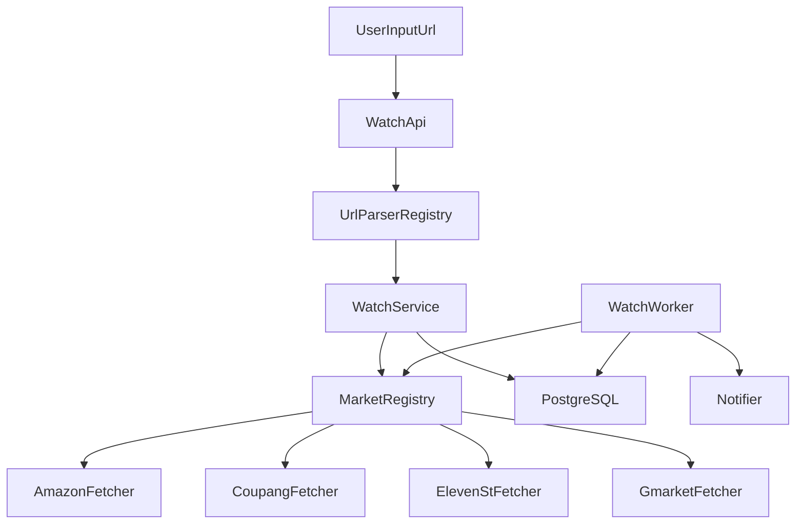

# 멀티 마켓 가격 추적 확장 상세 플렌

## 구현 상태

- 1단계: 완료
- 2단계: 완료
- 3단계: 완료
- 4단계: 완료
- 5단계: 완료
- 6단계: 완료
- 7단계: 완료
- 8단계: 완료
- 9단계: 완료
- 10단계: 완료

## 검증 결과

- `npm run typecheck` 통과
- `npm run lint` 통과
- `npm test` 통과

## 목표

현재 `Rare Pick`의 Amazon 중심 가격 추적 구조를 확장해 다음 마켓을 지원한다.

- `amazon`
- `coupang`
- `11st`
- `gmarket`

이 계획은 현재 코드베이스를 기준으로 작성했다. 핵심 방향은 “소스별 if/else 추가”가 아니라, `source` 중심 하드코딩을 `registry` 기반으로 일반화하는 것이다.

## 현재 상태 요약

현재 구현은 문서상 `쿠팡/아마존`을 말하지만, 실제 사용자 등록 경로는 Amazon만 허용하고 있다.

핵심 병목:

1. `lib/url-parser.js`가 사실상 Amazon만 허용
2. `components/watch-dashboard.js`가 클라이언트에서 먼저 URL을 파싱해 신규 마켓을 프론트에서 차단
3. `lib/watch-service.js`가 Amazon 초기 수집만 수행
4. `collector/run-watch-worker.js`가 Amazon만 재수집
5. `db/schema.sql`이 `source IN ('amazon', 'coupang')`로 고정
6. `render-api/server.js`, `cloudflare/click-worker/src/index.js`도 `amazon/coupang` enum만 허용

근거 코드:

```17:37:lib/url-parser.js
export function parseProductUrl(rawUrl) {
  const url = new URL(rawUrl)
  const host = url.hostname.toLowerCase()

  if (host.includes('amazon.')) {
    const externalId = parseAmazonExternalId(url)
    if (!externalId) {
      throw new Error('amazon URL에서 ASIN을 찾을 수 없습니다.')
    }
    return { source: 'amazon', externalId, canonicalUrl: url.toString() }
  }

  if (host.includes('coupang.com')) {
    const externalId = parseCoupangExternalId(url)
    if (!externalId) {
      throw new Error('coupang URL에서 상품 ID를 찾을 수 없습니다.')
    }
    throw new Error('현재 coupang URL 수집은 임시 보류 상태입니다. amazon URL을 사용해 주세요.')
  }

  throw new Error('현재는 amazon URL만 지원합니다.')
}
```

```37:45:collector/run-watch-worker.js
async function fetchCurrentPrice(watch) {
  const item = toFetchItem(watch)
  if (watch.source === 'amazon') {
    return fetchAmazonPrice(item)
  }
  if (watch.source === 'coupang') {
    throw new Error('coupang fetch is temporarily paused')
  }
  throw new Error(`unsupported source: ${watch.source}`)
}
```

```1:4:db/schema.sql
CREATE TABLE IF NOT EXISTS products (
  id BIGSERIAL PRIMARY KEY,
  source VARCHAR(20) NOT NULL CHECK (source IN ('amazon', 'coupang')),
  external_id VARCHAR(120) NOT NULL,
```

## 목표 아키텍처

멀티 마켓 지원 후에는 모든 마켓이 동일한 계약을 따르도록 만든다.

### 공통 계약

- URL 등록 입력: `productUrl`
- 내부 식별자: `source`, `externalId`, `canonicalUrl`
- 수집 결과 스냅샷:
  - `source`
  - `externalId`
  - `title`
  - `imageUrl`
  - `category`
  - `affiliateUrl`
  - `currency`
  - `price`
  - `fetchedWith`

### 권장 구조



핵심은 다음 두 레지스트리다.

- URL 파서 레지스트리: 어떤 URL이 어떤 `source`인지 판별
- 수집기 레지스트리: 어떤 `source`가 어떤 fetcher를 쓰는지 판별

## 구현 원칙

### 1. `source` slug는 영문으로 통일

권장 slug:

- `amazon`
- `coupang`
- `11st`
- `gmarket`

이유:

- 현재 DB `source` 컬럼 스타일과 맞음
- `VARCHAR(20)` 안에 안전하게 들어감
- UI에는 별도 표시명 매핑을 둘 수 있음

### 2. 서버를 단일 진실 공급원으로

현재는 `watch-dashboard.js`가 클라이언트에서 먼저 `parseProductUrl()`를 호출한다. 이 구조는 신규 마켓 추가 시 프론트 배포가 늦으면 서버 지원보다 먼저 막히는 문제가 있다.

따라서 계획은 다음과 같다.

- 클라이언트 선파싱은 제거하거나 보조 검증으로만 사용
- 실제 소스 판별은 서버 `createWatchJob()` 기준으로 수행

### 3. 신규 마켓 추가는 “등록 가능 여부”와 “수집 가능 여부”를 분리

예시:

- `supportsRegistration`
- `supportsWatchWorker`
- `supportsInitialCollect`

이렇게 하면 쿠팡처럼 부분 지원 상태도 명시적으로 관리 가능하다.

## 단계별 상세 계획

## 1단계: `source` 하드코딩을 중앙 상수/레지스트리로 이동 [완료]

### 대상 파일

- `lib/url-parser.js`
- `collector/run-price-collector.js`
- `collector/run-watch-worker.js`
- `lib/watch-service.js`
- `collector/repository.js`
- `render-api/server.js`
- `cloudflare/click-worker/src/index.js`

### 작업 내용

- `SUPPORTED_SOURCES` 상수 도입
- `MARKET_REGISTRY` 도입
- placeholder 제목 판별 정규식을 source 배열 기반으로 일반화

### 권장 신규 파일

- `lib/market-registry.js`

### 스니펫

```js
export const SUPPORTED_SOURCES = ['amazon', 'coupang', '11st', 'gmarket']

export const MARKET_LABELS = {
  amazon: '아마존',
  coupang: '쿠팡',
  '11st': '11번가',
  gmarket: 'G마켓',
}

export const MARKET_REGISTRY = {
  amazon: {
    supportsRegistration: true,
    supportsWatchWorker: true,
    supportsInitialCollect: true,
  },
  coupang: {
    supportsRegistration: true,
    supportsWatchWorker: true,
    supportsInitialCollect: true,
  },
  '11st': {
    supportsRegistration: true,
    supportsWatchWorker: true,
    supportsInitialCollect: true,
  },
  gmarket: {
    supportsRegistration: true,
    supportsWatchWorker: true,
    supportsInitialCollect: true,
  },
}
```

### 이유

현재는 동일한 `amazon|coupang` 하드코딩이 여러 파일에 흩어져 있다. 이 상태에서 11번가/G마켓을 추가하면 누락 가능성이 높다.

## 2단계: URL 파싱을 마켓별 파서 + 공통 진입점 구조로 분리 [완료]

### 대상 파일

- `lib/url-parser.js`

### 현재 문제

- Amazon만 통과
- Coupang은 일부 파싱 후에도 의도적으로 예외
- 11번가/G마켓 파싱 엔트리가 없음

### 목표 구조

- `parseAmazonUrl(url)`
- `parseCoupangUrl(url)`
- `parse11stUrl(url)`
- `parseGmarketUrl(url)`
- `parseProductUrl(rawUrl)`는 위 함수들을 순회하는 공통 진입점

### URL 규칙 초안

- Amazon: 기존 ASIN 규칙 유지
- Coupang: `/vp/products/<id>`
- 11번가: 상품 상세 URL에서 `prdNo` 또는 상품 ID 추출
- G마켓: 상품 상세 URL에서 `goodscode` 또는 상품 코드 추출

정확한 regex는 실제 운영 URL 샘플 수집 후 확정해야 한다.

### 스니펫

```js
function parse11stExternalId(url) {
  const byQuery = url.searchParams.get('prdNo')
  if (byQuery) return byQuery

  const byPath = url.pathname.match(/\/products\/(\d+)/i)
  return byPath?.[1] ?? null
}

function parseGmarketExternalId(url) {
  const byQuery = url.searchParams.get('goodscode')
  if (byQuery) return byQuery

  const byPath = url.pathname.match(/\/item\?.*goodscode=(\d+)/i)
  return byPath?.[1] ?? null
}

export function parseProductUrl(rawUrl) {
  const url = new URL(rawUrl)
  const host = url.hostname.toLowerCase()

  if (host.includes('amazon.')) {
    const externalId = parseAmazonExternalId(url)
    if (!externalId) throw new Error('amazon URL에서 ASIN을 찾을 수 없습니다.')
    return { source: 'amazon', externalId, canonicalUrl: url.toString() }
  }

  if (host.includes('coupang.com')) {
    const externalId = parseCoupangExternalId(url)
    if (!externalId) throw new Error('coupang URL에서 상품 ID를 찾을 수 없습니다.')
    return { source: 'coupang', externalId, canonicalUrl: url.toString() }
  }

  if (host.includes('11st.co.kr')) {
    const externalId = parse11stExternalId(url)
    if (!externalId) throw new Error('11번가 URL에서 상품 ID를 찾을 수 없습니다.')
    return { source: '11st', externalId, canonicalUrl: url.toString() }
  }

  if (host.includes('gmarket.co.kr')) {
    const externalId = parseGmarketExternalId(url)
    if (!externalId) throw new Error('G마켓 URL에서 상품 ID를 찾을 수 없습니다.')
    return { source: 'gmarket', externalId, canonicalUrl: url.toString() }
  }

  throw new Error('현재 지원하는 마켓 URL이 아닙니다.')
}
```

### 주의

- 11번가/G마켓는 모바일/단축/제휴/리다이렉트 URL 형태가 많을 수 있으므로 canonicalization 규칙을 같이 정해야 한다.

## 3단계: DB 스키마의 `source` 제한을 확장 또는 일반화 [완료]

### 대상 파일

- `db/schema.sql`

### 현재 문제

- `products.source`
- `affiliate_reports.source`
- `watch_jobs.source`

세 곳 모두 `amazon`, `coupang`만 허용한다.

### 최소 변경안

`CHECK (source IN ('amazon', 'coupang', '11st', 'gmarket'))`

### 권장 변경안

장기적으로는 `markets` 참조 테이블 도입을 고려한다. 다만 현재 MVP 스키마 규모에서는 먼저 체크 제약 확장이 비용 대비 효율이 높다.

### 스니펫

```sql
source VARCHAR(20) NOT NULL CHECK (
  source IN ('amazon', 'coupang', '11st', 'gmarket')
)
```

### 추가 고려

- 기존 DB 마이그레이션 문서 필요
- Render/Supabase/PostgreSQL 운영 환경별 적용 순서 정리 필요

## 4단계: 수집기 디스패치를 registry 기반으로 통합 [완료]

### 대상 파일

- `collector/run-price-collector.js`
- `collector/run-watch-worker.js`
- `lib/watch-service.js`

### 현재 문제

- 배치 수집기와 watch worker가 서로 다른 조건으로 분기
- watch 생성 직후 초기 수집은 Amazon 전용 함수만 존재

### 목표

- `getFetcherBySource(source)`
- `collectInitialSnapshotForWatch(parsed, watchRow)`
- `fetchCurrentPrice(watch)` 공통화

### 스니펫

```js
import { fetchAmazonPrice } from './fetchers/amazon-paapi.js'
import { fetchCoupangPrice } from './fetchers/coupang-openapi.js'
import { fetch11stPrice } from './fetchers/11st-html.js'
import { fetchGmarketPrice } from './fetchers/gmarket-html.js'

export const FETCHER_REGISTRY = {
  amazon: fetchAmazonPrice,
  coupang: fetchCoupangPrice,
  '11st': fetch11stPrice,
  gmarket: fetchGmarketPrice,
}

export function getFetcherBySource(source) {
  const fetcher = FETCHER_REGISTRY[source]
  if (!fetcher) {
    throw new Error(`unsupported source: ${source}`)
  }
  return fetcher
}
```

`collector/run-watch-worker.js` 쪽 예시:

```js
async function fetchCurrentPrice(watch) {
  const item = toFetchItem(watch)
  const fetcher = getFetcherBySource(watch.source)
  return fetcher(item)
}
```

`lib/watch-service.js` 쪽 예시:

```js
async function tryCollectInitialPrice({ source, watchId, productId, externalId, productUrl }) {
  const fetcher = getFetcherBySource(source)
  const snapshot = await fetcher({
    source,
    externalId,
    title: `[${source}] ${externalId}`,
    affiliateUrl: productUrl,
  })

  // 이후 저장 로직은 기존 tryCollectInitialAmazonPrice 구조를 재사용
}
```

### 이유

현재는 신규 마켓을 추가할 때마다 최소 3곳 이상에 if/else를 추가해야 한다.

## 5단계: 신규 fetcher 추가 [완료]

### 대상 파일

- `collector/fetchers/html-price.js`
- `collector/fetchers/11st-html.js` 신규
- `collector/fetchers/gmarket-html.js` 신규
- 기존 `collector/fetchers/coupang-openapi.js` 정리

### 현재 활용 가능한 공통 자산

- `fetchHtmlDocument()`
- `extractJsonLdPrice()`
- `extractByRegexList()`
- 브라우저 우선 / HTTP fallback

즉, 신규 마켓 fetcher는 HTML transport를 다시 만들 필요 없이 “상품 페이지 판별, 가격 추출, 메타데이터 추출”에 집중하면 된다.

### 11번가 fetcher 초안

```js
import { extractByRegexList, extractJsonLdPrice, fetchHtmlDocument } from './html-price.js'

function looksLike11stProductPage({ html, finalUrl, title }) {
  return /11st/i.test(finalUrl || '') || /11번가|11st/i.test(title || html || '')
}

function extract11stPrice(html) {
  const byJsonLd = extractJsonLdPrice(html)
  if (byJsonLd !== null) return byJsonLd

  return extractByRegexList(html, [
    /"salePrice"\s*:\s*"?(?:KRW)?\s*([0-9,]+(?:\.[0-9]+)?)"?/i,
    /class=["'][^"']*price[^"']*["'][^>]*>\s*([0-9,]+)\s*원/i,
    /([0-9][0-9,]{2,})\s*원/i,
  ])
}

export async function fetch11stPrice(item) {
  const doc = await fetchHtmlDocument(item.affiliateUrl, { language: 'ko-KR,ko;q=0.9' })
  const price = extract11stPrice(doc.html)

  if (price === null) {
    throw new Error(`11st price not found (finalUrl=${doc.finalUrl || 'unknown'})`)
  }

  return {
    source: '11st',
    externalId: item.externalId,
    title: item.title,
    imageUrl: null,
    category: null,
    affiliateUrl: item.affiliateUrl,
    currency: 'KRW',
    price,
    fetchedWith: 'html-scrape',
  }
}
```

### G마켓 fetcher 초안

```js
import { extractByRegexList, extractJsonLdPrice, fetchHtmlDocument } from './html-price.js'

function extractGmarketPrice(html) {
  const byJsonLd = extractJsonLdPrice(html)
  if (byJsonLd !== null) return byJsonLd

  return extractByRegexList(html, [
    /"sellingPrice"\s*:\s*"?(?:KRW)?\s*([0-9,]+(?:\.[0-9]+)?)"?/i,
    /class=["'][^"']*price_real[^"']*["'][^>]*>\s*([0-9,]+)\s*</i,
    /([0-9][0-9,]{2,})\s*원/i,
  ])
}

export async function fetchGmarketPrice(item) {
  const doc = await fetchHtmlDocument(item.affiliateUrl, { language: 'ko-KR,ko;q=0.9' })
  const price = extractGmarketPrice(doc.html)

  if (price === null) {
    throw new Error(`gmarket price not found (finalUrl=${doc.finalUrl || 'unknown'})`)
  }

  return {
    source: 'gmarket',
    externalId: item.externalId,
    title: item.title,
    imageUrl: null,
    category: null,
    affiliateUrl: item.affiliateUrl,
    currency: 'KRW',
    price,
    fetchedWith: 'html-scrape',
  }
}
```

### 현실적 메모

11번가/G마켓 DOM은 자주 바뀔 수 있으므로 1차 목표는 `price + source + externalId + currency` 안정화다. 제목/이미지/카테고리는 2차 확장으로 두는 것이 안전하다.

## 6단계: Watch 등록 서비스 일반화 [완료]

### 대상 파일

- `lib/watch-service.js`

### 현재 문제

- `tryCollectInitialAmazonPrice()`가 Amazon 전용
- placeholder 제목 보존 정규식이 `amazon|coupang`에 고정
- DTO에 통화 정보가 없음

### 작업 내용

1. `tryCollectInitialAmazonPrice()`를 `tryCollectInitialPrice()`로 일반화
2. placeholder 제목 판별 로직을 source 배열 기반으로 치환
3. `watch DTO`에 `lastPriceCurrency` 추가 검토
4. `listWatchJobs()`에서도 최소 통화 정보를 함께 반환하도록 확장 검토

### 스니펫

```js
function buildPlaceholderTitleRegex() {
  return new RegExp(`^\\[(${SUPPORTED_SOURCES.join('|')})\\]\\s+[A-Za-z0-9_-]+`, 'i')
}
```

또는 SQL 바깥으로 옮겨 애플리케이션 레이어에서 제어하는 편이 더 유지보수에 좋다.

### DTO 예시

```js
{
  id: String(row.id),
  source: row.source,
  externalId: row.external_id,
  productUrl: row.product_url,
  lastPrice: row.last_price === null ? null : Number(row.last_price),
  lastPriceCurrency: row.last_price_currency ?? null,
}
```

현재 스키마에는 `watch_jobs.last_price_currency`가 없으므로, 이 필드가 필요하다면 별도 컬럼 추가 또는 `price_history` 최신 레코드 join 전략이 필요하다.

## 7단계: UI를 멀티 마켓 친화적으로 변경 [완료]

### 대상 파일

- `components/watch-dashboard.js`
- `app/layout.js`
- `components/product-dashboard.js`
- `lib/mock-data.js`

### 현재 문제

- placeholder가 Amazon URL 한 종류만 표시
- `formatMoney()`가 무조건 `₩` 표시
- title fallback도 `[source] externalId` 단순 조합
- 메타/설명 문구가 `쿠팡/아마존`에 고정

### 작업 내용

1. 클라이언트 선파싱을 제거하거나 서버 실패 메시지 중심 UX로 변경
2. 입력 placeholder를 복수 예시로 변경
3. 지원 마켓 안내 UI 추가
4. 가격 렌더링을 통화 기반으로 표시
5. watch 목록에 `source` 표시명을 매핑

### 스니펫

```js
function formatMoney(value, currency = 'KRW') {
  if (value === null || value === undefined) return '-'

  if (currency === 'USD') {
    return `$${Number(value).toLocaleString('en-US')}`
  }

  return `₩${Number(value).toLocaleString('ko-KR')}`
}
```

입력 예시:

```jsx
<input
  required
  type="url"
  placeholder="Amazon / Coupang / 11번가 / G마켓 상품 URL"
  value={productUrl}
  onChange={(event) => setProductUrl(event.target.value)}
/>
```

### 권장 UX 문구

- “지원 마켓: 아마존, 쿠팡, 11번가, G마켓”
- “일부 마켓은 수집 안정화 단계일 수 있습니다.”

## 8단계: 대체 API 경로도 동일 정책으로 맞춤 [완료]

### 대상 파일

- `render-api/server.js`
- `cloudflare/click-worker/src/index.js`

### 현재 문제

이 두 파일은 `source must be amazon or coupang`로 하드코딩돼 있다.

### 작업 내용

- `SUPPORTED_SOURCES`와 동일한 enum으로 확장
- 가능하면 별도 공통 모듈을 공유하거나, 최소한 동일 slug를 사용

### 스니펫

```js
if (!['amazon', 'coupang', '11st', 'gmarket'].includes(body?.source)) {
  return { status: 400, body: { error: 'source must be one of amazon, coupang, 11st, gmarket' } }
}
```

### 메모

현재 Next API는 `productUrl`만 받아 내부 파싱을 수행하고, `render-api`/Cloudflare worker는 `source`, `externalId`를 외부에서 받는다. 장기적으로는 계약 통일이 필요하다.

## 9단계: 운영/문서 업데이트 [완료]

### 대상 파일

- `README.md`
- `리서치.md`
- 필요 시 `docs/nextjs-mvp-structure.md`

### 작업 내용

- 지원 마켓 현황 명시
- 각 마켓이 HTML 스크레이핑 기반이라는 점 명시
- 마켓별 지원 상태 표 추가

예시 표:

| source | 등록 | 초기 수집 | 워커 재수집 | 메타데이터 |
| --- | --- | --- | --- | --- |
| amazon | 지원 | 지원 | 지원 | 높음 |
| coupang | 지원 | 지원 | 지원 | 중간 |
| 11st | 지원 | 지원 | 지원 | 낮음 |
| gmarket | 지원 | 지원 | 지원 | 낮음 |

## 10단계: 테스트 계획 [완료]

현재 저장소에 테스트는 없다. 신규 마켓 확장 시 최소 아래는 필요하다.

### URL 파싱 테스트

- Amazon 정상/오류 URL
- Coupang 정상/오류 URL
- 11번가 정상/오류 URL
- G마켓 정상/오류 URL

### fetcher 테스트

- 상품 HTML에서 가격 추출 성공
- 가격 없음
- 차단/비상품 페이지
- 통화 판별

### worker 테스트

- 각 `source`가 올바른 fetcher를 타는지
- `target_price`
- `new_lowest`
- unsupported source

### 회귀 테스트

- Amazon 기존 플로우 유지
- localStorage fallback이 여전히 동작
- DB schema 확장 후 insert/upsert 정상 동작

## 우선순위

### P0

- `db/schema.sql` 확장
- `lib/url-parser.js` 멀티 마켓 지원
- `collector` 디스패치 registry 도입
- `watch-service` 초기 수집 일반화

### P1

- 11번가/G마켓 fetcher 추가
- `watch-dashboard.js` 통화/문구/placeholder 개선
- `render-api`/Cloudflare worker enum 확장

### P2

- 문서 보강
- 테스트 도입
- source ref table 또는 공통 모듈화

## 예상 리스크

1. 11번가/G마켓 DOM 변경 빈도 때문에 regex 기반 추출이 쉽게 깨질 수 있다.
2. anti-bot 정책이 강하면 `browser-first` + `http-only` 모두 실패할 수 있다.
3. 현재 UI는 로컬 상태를 진실 원천처럼 사용하므로, 서버 저장 성공 여부와 사용자 체감이 어긋날 수 있다.
4. placeholder 제목 보존 정규식이 누락되면 실제 상품명이 덮어써지지 않거나 반대로 placeholder가 남을 수 있다.
5. 통화가 KRW 외로 확장되면 현재 `watch_jobs.last_price`만으로는 표시 정보가 부족하다.

## 권장 구현 순서

1. `source` 상수/registry 도입
2. URL parser 일반화
3. DB CHECK 확장
4. watch-service 초기 수집 일반화
5. watch worker / batch collector fetcher dispatch 통합
6. 11번가 fetcher 추가
7. G마켓 fetcher 추가
8. watch-dashboard 통화/문구/placeholder 개선
9. render-api / Cloudflare worker 동기화
10. README 및 지원 상태 표 갱신

## 최종 판단

이 기능은 “마켓 3개 추가”처럼 보이지만, 실제로는 현재 Amazon 중심 설계를 멀티 마켓 아키텍처로 일반화하는 작업이다. 가장 중요한 성공 조건은 fetcher 개수보다 `source` 하드코딩 제거와 `registry` 도입이다. 이 두 축이 먼저 정리되면 쿠팡/11번가/G마켓 지원은 파일 추가 작업으로 수렴하지만, 그 전에는 작은 수정이 곳곳의 불일치를 만들 가능성이 높다.
